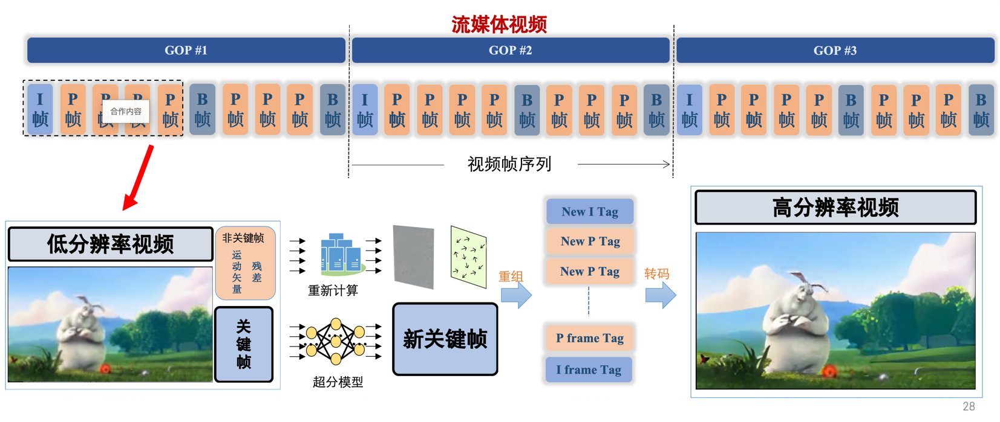
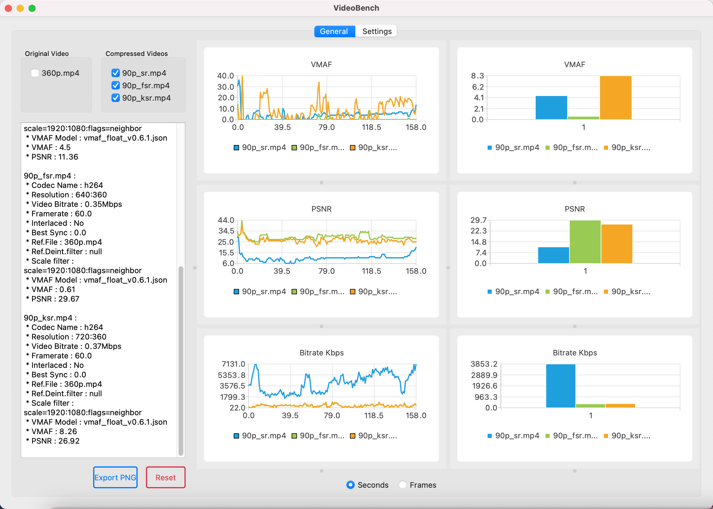

# KeyFrame Super Resolution
使用ffmpeg,realbasicVsr实现的一个视频快速超分系统（仅超分关键帧，并扩大非关键帧） 


## Theory


1. 使用realBasicVSR 对关键帧超分辨率
2. 使用ffmpeg对流媒体视频进行关键帧提取、重组、转码等操作

https://github.com/NOMADxzy/basicKVSR/assets/52481325/c9271faf-259b-435e-9a6b-627630c8bcf2

## Quick Start

### Choice1 - Dockerfile Automated deployment
先[下载](https://drive.google.com/file/d/1OYR1J2GXE90Zu2gVU5xc0t0P_UmKH7ID/view)模型到 `realbasicvsr_flask/checkpoints/` 下

```shell
docker build -t sr -f ./Dockerfile ./ 
docker run --name sr -dit -p 5000:5000 sr
```
准备视频`test.mp4`到 `in/`下 && 在main.go中指定 `inFile := "in/test.mp4"`    
在 `sr/sr.go` 中指定后端地址 `http://localhost:5000/`
```shell
$ go get
$ go run main.go 
```

### Choice2 - Manual deployment

1.启动RealBasicVSR后端
```shell
$ cd flask_realbasicvsr
# install dependencies
$ conda install pytorch::pytorch torchvision torchaudio -c pytorch

$ pip install -r requirements.txt
$ mim install mmcv-full

# run backend
$ python inference_flask.py
```

2.运行超分处理
```shell
# 在项目root目录下
$ go get # 下载相关的依赖包
$ go run main.go # 运行项目
```

## Preview

    
    左：超分后(720p)
    右：原视频(180p)


## Benchmark
```text
90p_fsr.mp4：超分前
90p_ksr.mp4：关键帧超分
90p_sr.mp4：全部帧超分
```

benchmark tool from [videobench](https://github.com/JNoDuq/videobench)


## Support

[RealBasicVSR](https://github.com/ckkelvinchan/RealBasicVSR)    
[ffmpeg-go](https://github.com/u2takey/ffmpeg-go)


## Citation

```text
@article{cao2021vsrt,
title={realbasic keyframe video super resolution},
author={Zuyun Xu},
year={2023}
}
```
