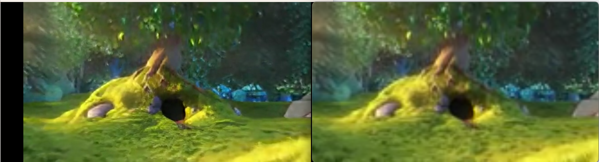
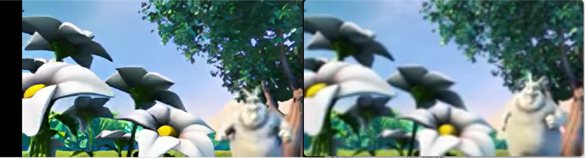

# 视频超分系统
使用ffmpeg,realbasicVsr实现的一个视频快速超分系统（仅超分关键帧，并扩大非关键帧），仅供学习使用～


## Quick Start

1.启动RealBasicVSR后端
```shell
$ cd flask_realbasicvsr
# 下载相关的依赖包
$ pip install openmim
$ mim install mmcv-full
$ pip install mmedit
$ conda install pytorch::pytorch torchvision torchaudio -c pytorch

# 运行
$ python inference_flask.py
```

2.运行超分处理
```shell
# 在项目root目录下
$ go get # 下载相关的依赖包
$ cd sr
$ go run main.go # 运行项目
```

## Preview

    
    左：超分后(720p)
    右：原视频(180p)





